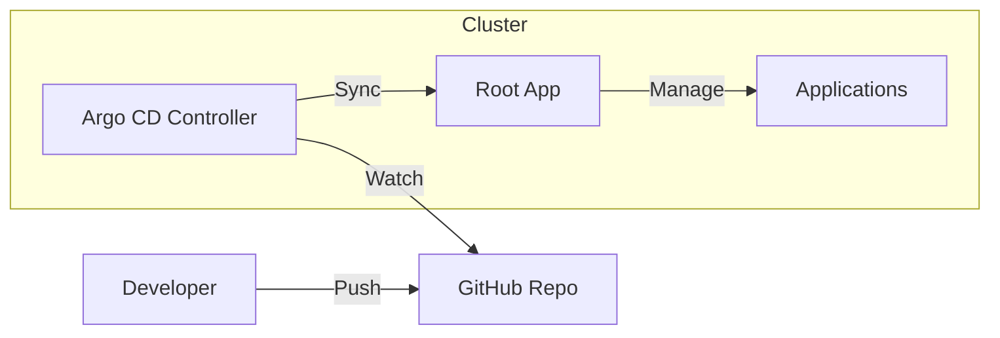

# Kubernetes GitOps with Argo CD

This repository manages the state of my Kubernetes cluster using the GitOps methodology with Argo CD.

## 🏗️ Architecture

The cluster state is synchronized from this repository. Changes pushed to the `main` branch are automatically applied to the cluster.



### Repository Structure

```
k8s-gitops/
├── apps/
│   ├── base/                    # Argo CD Application definitions
│   └── manifests/               # Kubernetes manifests (Kustomize)
├── argocd/
│   └── root-app.yaml           # App of Apps pattern entry point
└── docs/                        # Documentation & Guides
```

## 📱 Application Catalog

The following applications are currently deployed and managed via GitOps:

| Application | Description | Category |
|-------------|-------------|----------|
| **Coder** | Cloud development environments | Dev Tools |
| **CoreDNS** | Cluster DNS service | System |
| **Excalidraw** | Virtual whiteboard for sketching | Productivity |
| **Harbor** | Cloud native registry project | Infrastructure |
| **Headlamp** | Easy-to-use Kubernetes web UI | Management |
| **Ingress Nginx** | Ingress controller for Kubernetes | Networking |
| **Local Path** | Local storage provisioner | Storage |
| **MetalLB** | Bare metal load-balancer | Networking |
| **Metrics Server** | Resource metrics collector | Monitoring |
| **Monitoring** | Prometheus & Grafana stack | Monitoring |
| **Nextcloud** | Productivity platform | Productivity |
| **Ollama** | Local LLM runner | AI |
| **Remote Dev VM** | Remote development virtual machine | Dev Tools |
| **Sealed Secrets** | Encrypted secrets management | Security |
| **Tailscale** | Mesh VPN for secure access | Networking |
| **ThinkDashboard** | Personal dashboard | Management |

## 🧩 The "App of Apps" Pattern

This repository uses the **App of Apps** pattern.

1. **Root App**: `argocd/root-app.yaml` is the only manifest applied manually.
2. **Child Apps**: The root app points to `apps/base/`, which contains `Application` definitions for all other services.
3. **Automation**: Adding a new file to `apps/base/` automatically deploys that application.

## 🛠️ Operations

### Quick Start

To access the Argo CD UI:

```bash
# Port forward to Argo CD server
kubectl port-forward svc/argocd-server -n argocd 8080:443

# Get admin password
kubectl -n argocd get secret argocd-initial-admin-secret -o jsonpath="{.data.password}" | base64 -d
```

Access: <https://localhost:8080>

### Managing Applications

| Action | Steps |
|--------|-------|
| **Add App** | 1. Add manifests to `apps/manifests/<name>`<br>2. Add App definition to `apps/base/<name>.yaml`<br>3. Commit & Push |
| **Update App** | 1. Modify manifests in `apps/manifests/<name>`<br>2. Commit & Push |
| **Remove App** | 1. Delete `apps/base/<name>.yaml`<br>2. Commit & Push (Argo CD will prune resources) |

### Troubleshooting

- **App won't sync?**
  `kubectl describe application <app-name> -n argocd`
- **Manual changes reverted?**
  This is by design (Self-Heal). Commit changes to Git instead.

## 📚 Documentation

- [Migration Guide](docs/migration.md) - How this repo was created.
